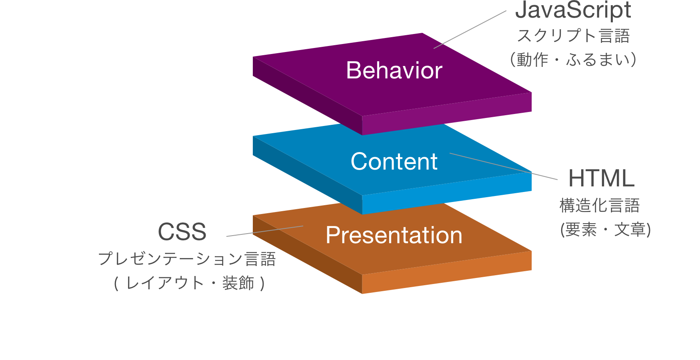
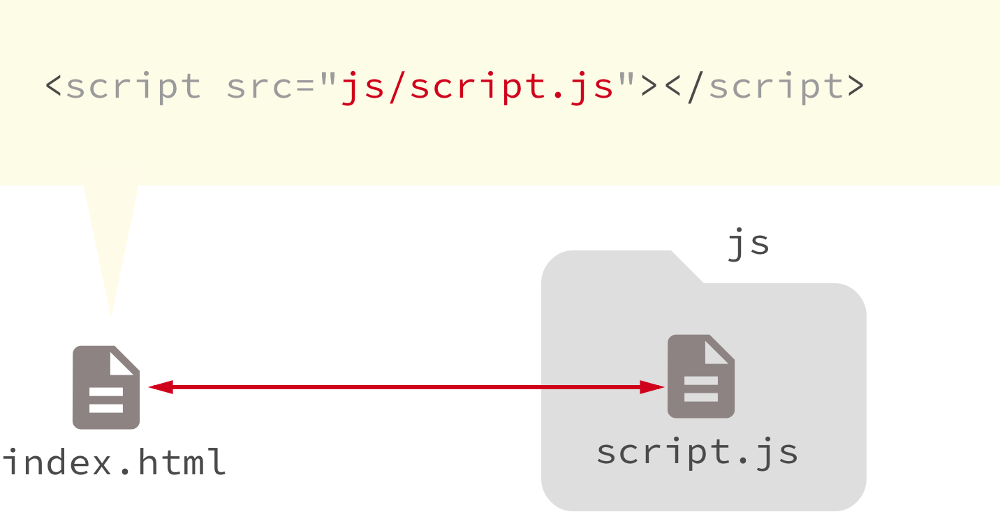
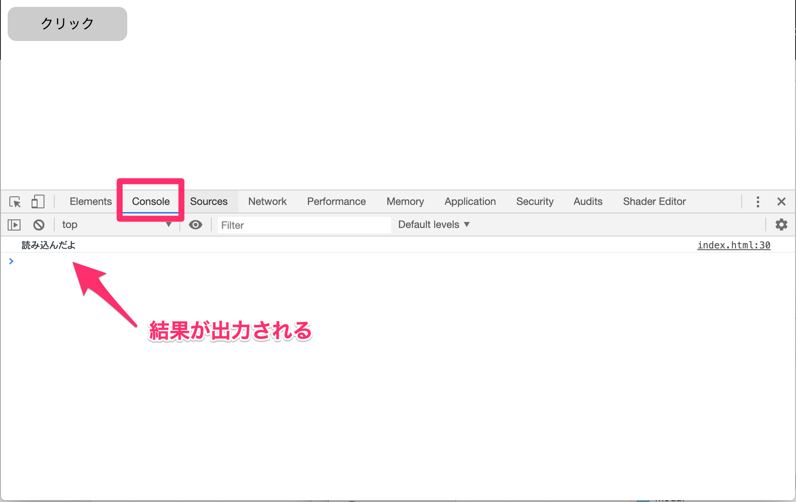
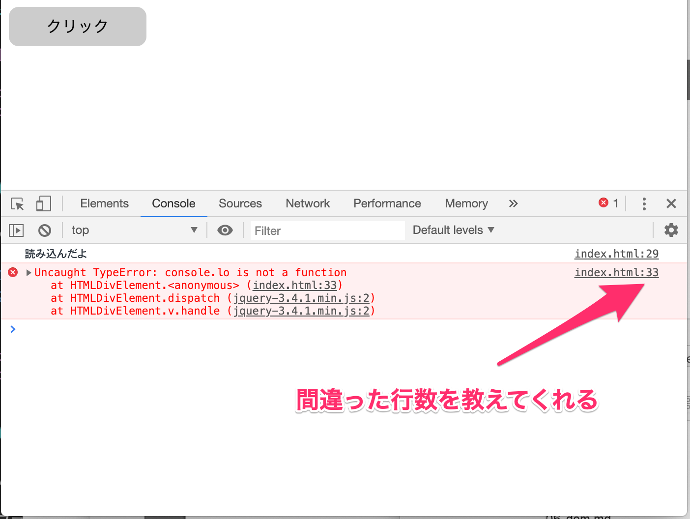

# JavaScript

* JavaScriptの役割
* JavaScriptの記述場所
* JavaScriptの文法
* コンソール
* コメント

&nbsp;

---

&nbsp;
&nbsp;

## JavaScriptの役割




&nbsp;
&nbsp;


## JavaScriptの記述場所

### 1. HTML内に記述

html

```

	</footer>
	<script>

    	// ここにJavaScriptを記述する

	</script>
	</body>
</html>
```
&nbsp;
&nbsp;


### 2. 外部jsファイルに記述



&nbsp;
&nbsp;


## JavaScriptの文法

2つの記述パターン

* 1. 命令式
* 2. 代入式


&nbsp;
&nbsp;


## 1. 命令文

JavaScriptからHTMLタグへ命令を出す


```
命令の名前(引数);
```

引数とは命令に渡す値(パラメーター)

```
alert('alertのテスト');
```

### 大文字と小文字を混同すると動作しない

```
Alert('alertのテスト');
```


&nbsp;
&nbsp;


## 2. 代入式

HTMLの属性に何からの値を保存させる


```
要素.属性 = 値;
```

* 記述は半角英数
* セミコロンが文の区切りになる
* = ()の前後に半角スペースを入れてもOK


> プログラミングの = (イコール) は 左辺に右辺の値を保存すること
&nbsp;

```
document.querySelector('#ttl').style.color = '#FF0000';
```

この文を日本語に訳すと、

HTML`document`からid `querySelector`を取り出しCSS`style`の文字色`color`を`#FF0000`に変更する

&nbsp;
&nbsp;


### ドットシンタックス
オブジェクトと命令を .(ドット)でつなげて記述する

```
document.querySelector('#ttl').style.color = '#FF0000';
```


&nbsp;
&nbsp;


## コンソール

JavaScriptで書いたソースの内容を確認する方法

1.ブラウザ上で右クリックして`検証`

2.`Console`タブを選択

```
console.log('読み込んだよ');

```




エラーの場合でも確認ができる




&nbsp;
&nbsp;


## コメント

コメントとはプログラミング内に記述する「メモ書き」のようなもの

```
// 1行のコメント

/*
複数行コメント
複数行コメント
*/
```

&nbsp;
&nbsp;

---