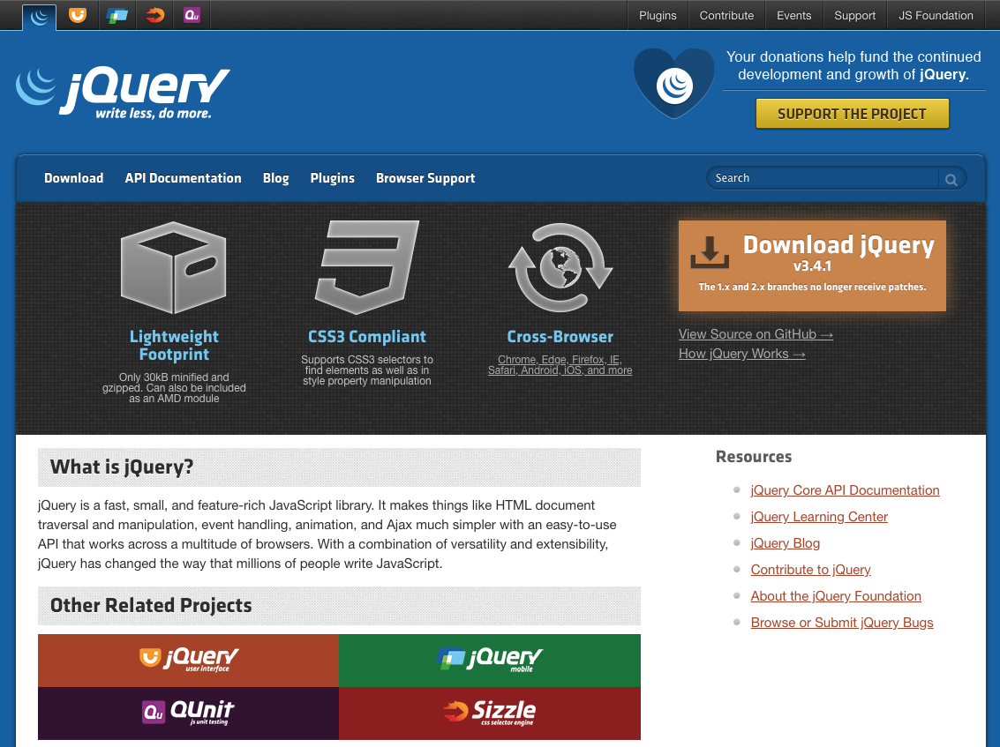
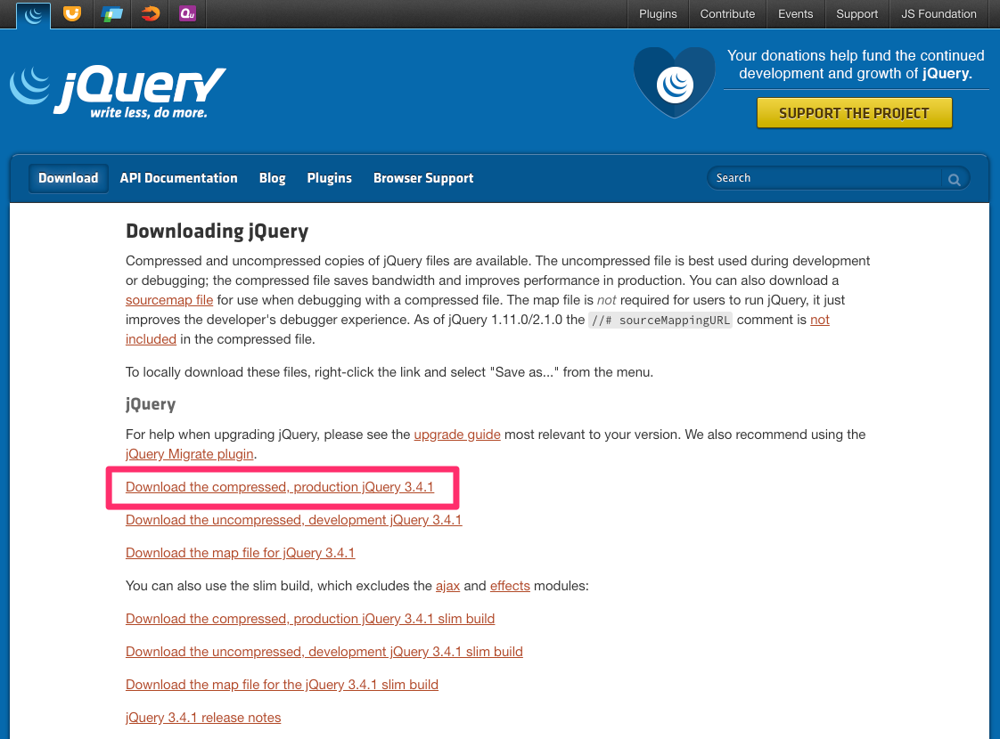
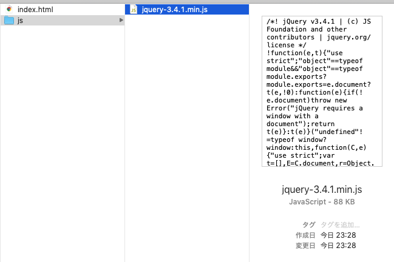
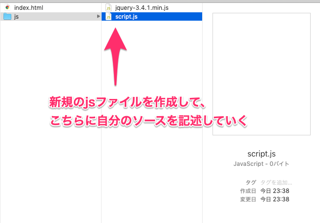

# jQuery

---

&nbsp;
&nbsp;

## jQueryの役割

[https://jquery.com/](https://jquery.com/)

JavaScriptの構文を簡略化して記述することができるライブラリ




&nbsp;
&nbsp;

## jQueryのダウンロード1

[https://jquery.com/download/](https://jquery.com/download/)



&nbsp;

### 右クリックで「リンク先を別名で保存」

&nbsp;



jsフォルダを作成してダウンロードしたファイルを保存する

&nbsp;

### HTMLにjQueryを読み込む

#### index.html

```
<footer/>

<script src="js/jquery-3.4.1.min.js"></script>
</body>
</html>

```

`body`の閉じタグの前に`script`タグを作成して読み込む

&nbsp;
&nbsp;


## jQueryのダウンロード2

### HTMLにjquery.comからサーバー経由でjQueryを読み込む

#### index.html


```
<footer/>

<script src="https://code.jquery.com/jquery-3.4.1.min.js"></script>
</body>
</html>

```

`body`の閉じタグの前に`script`タグを作成して`https:~`から読み込む

> インターネットに接続していないと使用できない。

&nbsp;
&nbsp;


## JavaScriptの記述場所

### jsファイルに記述




```
<footer/>

<script src="https://code.jquery.com/jquery-3.4.1.min.js"></script>
<script src="js/script.js"></script>
</body>
</html>

```
> ライブラリ（jQuery）の読み込みが先。自分のソースが後

&nbsp;
&nbsp;


## jQueryの文法

jQueryの記述パターンはこの3つ

*  1. HTMLの読み込み待ち　read
*  2. DOM（HTML）の操作 selector
*  3. イベントの操作　on


&nbsp;
&nbsp;

## HTMLの読み込み待ち ready

JavaScriptを実行する場合、ブラウザがHTMLタグを読み込み終えてから処理を始めないと、操作対象が見つからなくなる。

##### script.js

```
jQuery(document).ready(function(){
  //HTMLの読み込みが終わるとこの中が実行される
});

```


&nbsp;

### readyの短い書き方

##### script.js

```
$(function(){
  //HTMLの読み込みが終わるとこの中が実行される
});

```

> '$' は jQueryの略称


&nbsp;
&nbsp;


参照: [jQueryの基本 - $(document).ready](https://qiita.com/8845musign/items/88a8c693c84ba63cea1d)


&nbsp;
&nbsp;

---